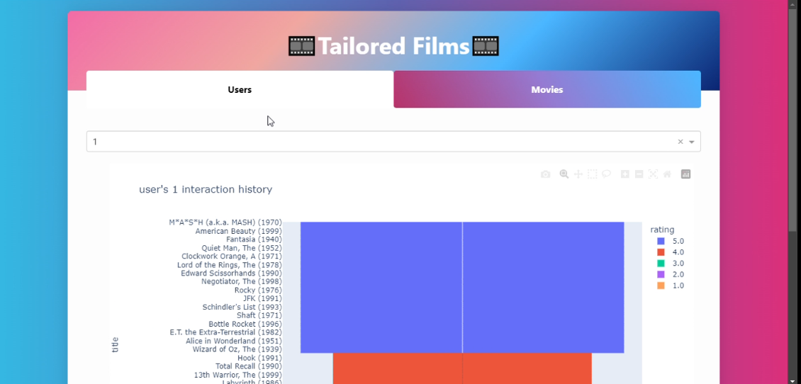
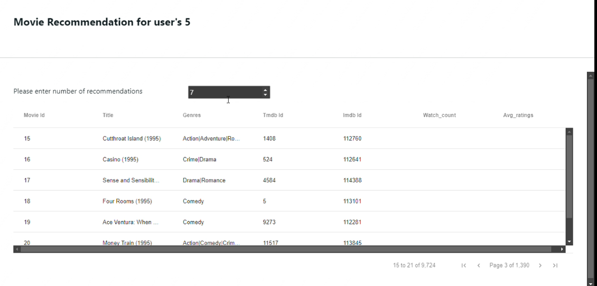
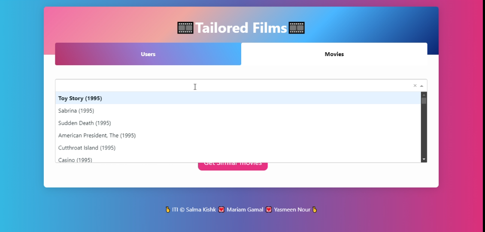
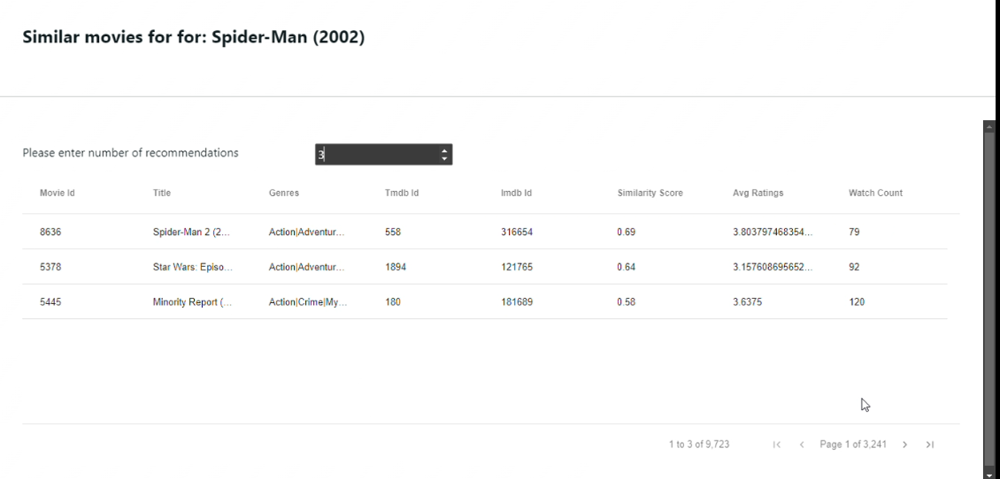

# Recommender-systems based on movie lens dataset
This repository contains the code and resources for a project involves developing a recommendation system for movies.
The system consists of two main sections :
  1. recommend movies for users.
  2. getting similarity scores between provided movie using a similarity matrix.
  
  For interface we used Dash Plotly app.

---
# DataSet
ml-latest-small movie lens dataset:
- Describes 5-star rating and free-text tagging activity from MovieLens, a movie recommendation service. It contains 100836 ratings and 3683 tag applications across 9742 movies.
- These data were created by 610 users between March 29, 1996 and September 24, 2018. This dataset was generated on September 26, 2018.

The data we used are contained in the files movies.csv , ratings.csv and tags.csv.
 
[DataSet link](https://www.kaggle.com/datasets/shubhammehta21/movie-lens-small-latest-dataset)

---
# 

# Getting Started
To get started with the project, you will need to clone the repository to your local machine: 
git clone  https://github.com/salmakishk98/Recommender-systems-project.git  

Once you have cloned the repository, you can open the project in your preferred code editor and start exploring the code.

# Project Structure

---

# App Interface

---
# Authors
  1- [Salma Kishk](https://github.com/salmakishk98) 
  2- [Yassmen Nour](https://github.com/YasmeenNour) 
  3- [Mariam Gamal](https://github.com/Mariam111) 

  
---
# Contributing
Thank you for your interest in contributing to our project! 
We welcome contributions from everyone. 

